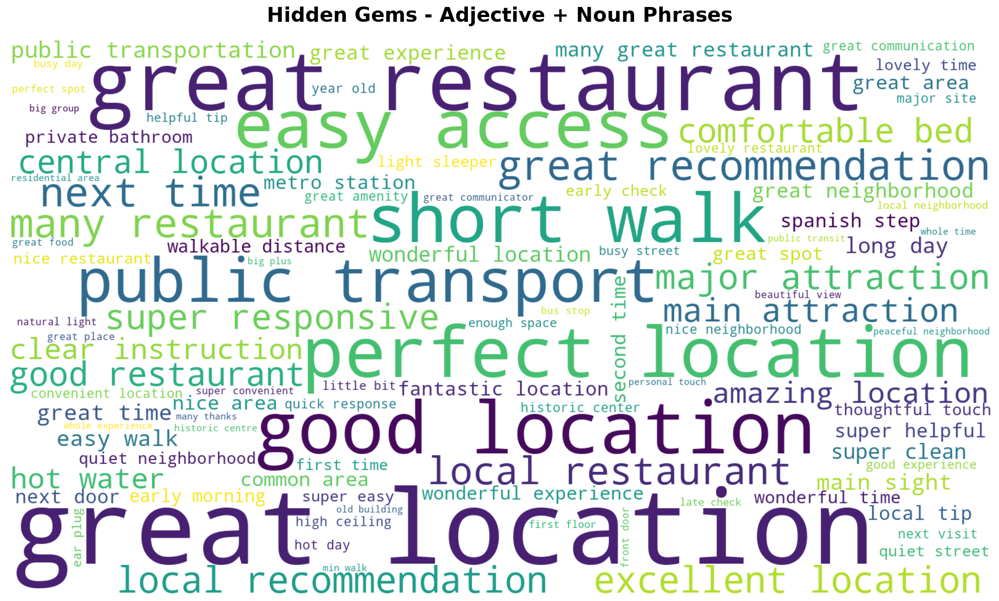
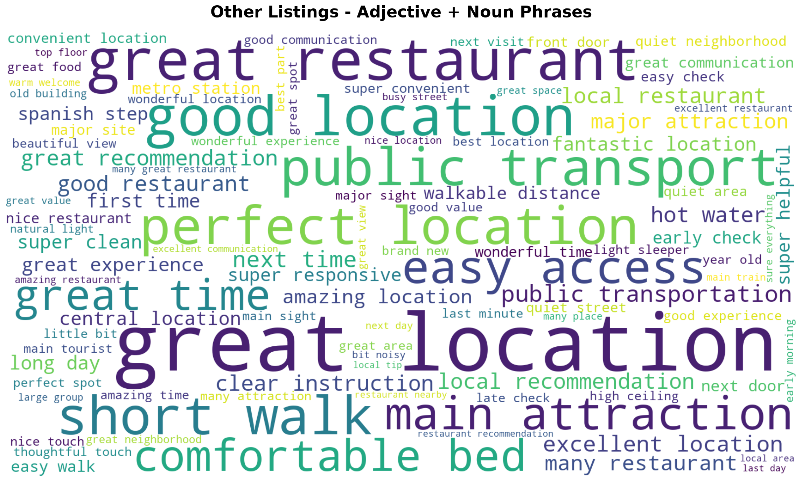

# בעיה 4 – ניתוח מחודש של שפת הביקורות על נכסי Hidden Gem

**שיטה:** לצורך ניתוח שפת הביקורות הופרדו הביקורות לשתי קבוצות – ביקורות על 453 נכסי ה-Hidden Gems וביקורות על יתר הנכסים. תחילה בוצע סינון שפה באמצעות הספרייה `langdetect`, שהופעלה על כל ביקורת בנפרד, ונשמרו רק ביקורות שזוהו כאנגליות (1,915 מתוך 2,365 ביקורות על נכסי Hidden Gem, ו-337,721 מתוך 618,660 ביקורות על יתר הנכסים). לאחר מכן עברו הביקורות שלב עיבוד מקדים שכלל פירוק למילים (Tokenization), תיוג חלקי דיבר (POS-Tagging) על הטקסט המקורי לצורך דיוק התיוג, והמרה לאותיות קטנות (lowercase) של כל מילה לפני שהיא נבדקת ונספרת – כך שאותו צירוף באותיות שונות (למשל "Great Location" ו-"great location") ממוזג לרשומה אחת בלבד ואינו נספר או מוצג בענן פעמיים. מהטקסט הוסרו מילות עצירה סטנדרטיות, וכן מילות רעש הקשורות ישירות לתחום (כגון Rome, apartment, Airbnb, host, room) שאינן תורמות להבחנה בין הקבוצות.

מתוך כל ביקורת חולצו צירופים סמוכים בני 2 עד 3 מילים בלבד (לעולם לא יותר), המורכבים אך ורק ממילים המתויגות כתואר או כשם עצם, ובלבד שהצירוף מכיל לפחות תואר אחד ולפחות שם עצם אחד – למשל "great location" (תואר+שם עצם) או "great quiet neighborhood" (תואר+תואר+שם עצם). כל מילה בצירוף עברה בסוף התהליך Lemmatization לצורת הבסיס שלה. תדירות הצירופים נספרה בנפרד בכל קבוצה, ולאחר מכן הוצגה הן בטבלאות עשרת הצירופים המובילים והן בענני מילים שנבנו באותן הגדרות עיצוב וסגנון שבהם נעשה שימוש בניתוח הקודם.

## עשרת הצירופים המובילים

**טבלה 1 – Hidden Gems (מתוך 1,915 ביקורות באנגלית):**

| # | צירוף | מספר הופעות |
|---|---|---|
| 1 | great location | 98 |
| 2 | great restaurant | 57 |
| 3 | good location | 44 |
| 4 | perfect location | 41 |
| 5 | short walk | 38 |
| 6 | easy access | 38 |
| 7 | public transport | 31 |
| 8 | great recommendation | 27 |
| 9 | next time | 26 |
| 10 | many restaurant | 26 |

**טבלה 2 – שאר הנכסים (מתוך 337,721 ביקורות באנגלית):**

| # | צירוף | מספר הופעות |
|---|---|---|
| 1 | great location | 17,148 |
| 2 | great restaurant | 7,967 |
| 3 | good location | 7,208 |
| 4 | short walk | 6,641 |
| 5 | perfect location | 6,390 |
| 6 | public transport | 6,355 |
| 7 | easy access | 5,045 |
| 8 | main attraction | 4,825 |
| 9 | comfortable bed | 4,377 |
| 10 | great time | 4,203 |

## ענני המילים

### Word Cloud - Hidden Gems Reviews

### Word Cloud - Other Properties Reviews

## מסקנות

השוואת שתי הטבלאות מראה קודם כול קווי דמיון בולטים: שבעה מתוך עשרת הצירופים המובילים משותפים לשתי הקבוצות (great location, great restaurant, good location, perfect location, short walk, easy access, public transport), וברוב המקרים גם סדר הדירוג ביניהם כמעט זהה. בשתי הקבוצות צירופים הקשורים למיקום ולנגישות תופסים את רוב המקומות המובילים, מה שמצביע על כך שמיקום נוח הוא הגורם הבולט ביותר בשפת הביקורות של אורחי Airbnb ברומא, ללא קשר לשאלה אם הנכס הוגדר כ-Hidden Gem.

ההבדלים בין הקבוצות עדינים יותר. בביקורות על נכסי Hidden Gem מופיעים בעשירייה הפותחת הצירופים "great recommendation" ו-"many restaurant", שאינם מופיעים בעשירייה המקבילה של יתר הנכסים – רמז אפשרי להיבט אישי יותר של אינטראקציה עם המארח ושל היכרות עם מסעדות בסביבה, מעבר לתיאור המיקום גרידא. לעומת זאת, בביקורות על יתר הנכסים מופיעים "main attraction" ו-"comfortable bed" ו-"great time", המתמקדים יותר באתרי תיירות מרכזיים ובסטנדרט הפיזי של הנכס. יש לפרש הבדלים אלה בזהירות רבה: קבוצת ה-Hidden Gems כוללת 1,915 ביקורות בלבד לעומת 337,721 ביקורות בקבוצת ההשוואה, ואי-איזון בסדר גודל כזה מגדיל את הרגישות לתנודות אקראיות בצירופים הנמצאים קרוב לתחתית העשירייה. לכן אין לראות בהבדלים אלה ממצא מובהק, אלא לכל היותר מגמה חלשה התואמת את הממצא הכללי מהניתוח המקורי של בעיה 4 – שההבדל בין נכסי Hidden Gem לשאר הנכסים בא לידי ביטוי בעיקר במאפיינים הכמותיים של הנכס ולא בשפה שבה אורחים מתארים את חוויית האירוח.
