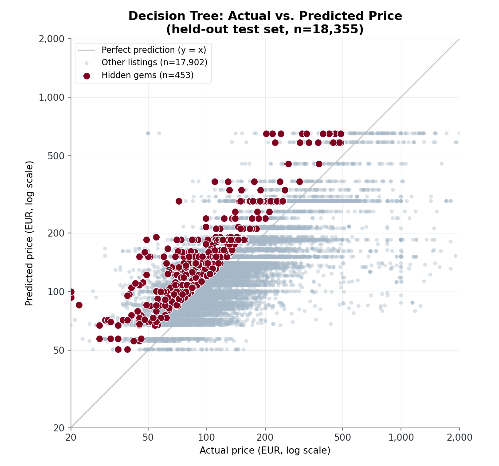
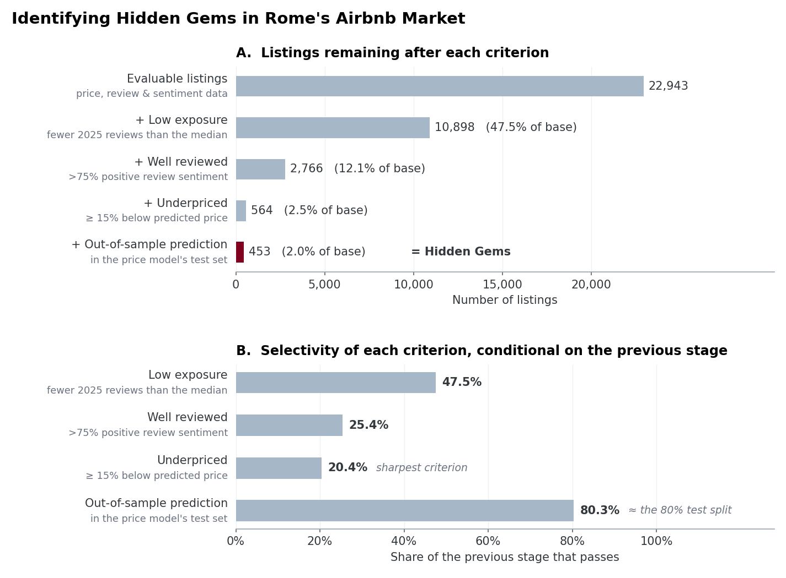
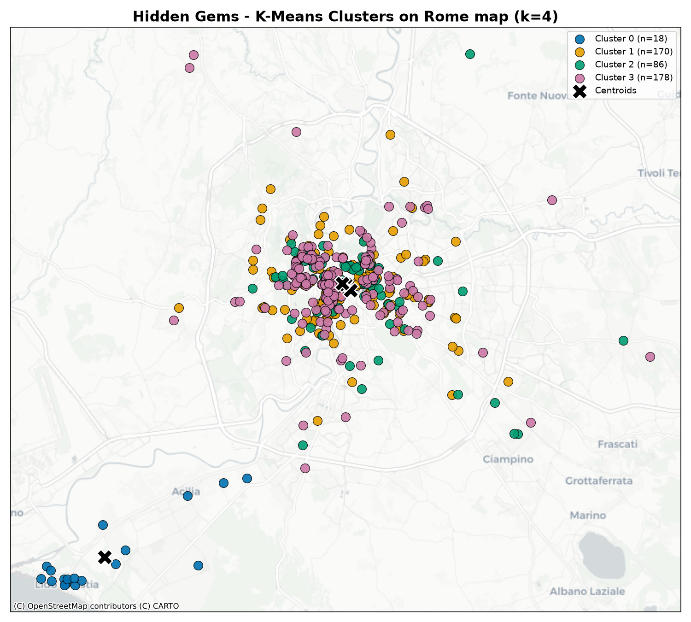
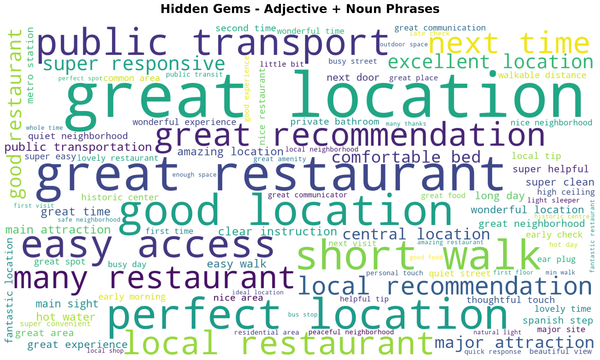
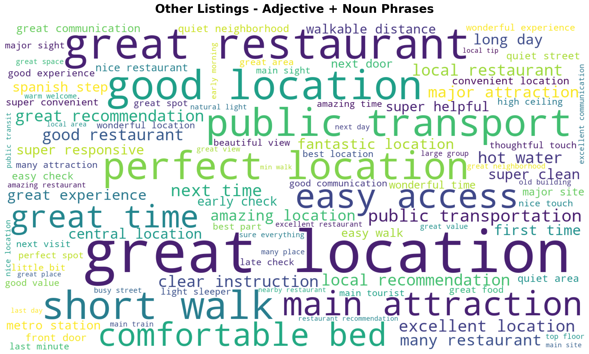

# בעקבות הפנינים הנסתרות: זיהוי Hidden Gems בשוק ה-Airbnb ברומא

*טיוטת דוח סופי להגשה, בנוי לפי מבנה ההגשה של הקורס (כותרת, צוות, דומיין, נתונים, לכל בעיה - פתרון והערכה, עבודה עתידית, מסקנה). לפני ההגשה: להמיר ל-PDF, לוודא עמידה במגבלת 6 העמודים (לא כולל תמונות), ולשנות את שם הקובץ ל-`writeup_group##.pdf`.*

## צוות

- [שם מלא] — [אימייל] — [ת.ז / מספר סטודנט]
- *(להוסיף חברות/חברי צוות נוספים בהתאם)*

## דומיין

פלטפורמות השכרה קצרת־טווח, כגון Airbnb, מציעות אלפי נכסים המתחרים על חשיפת המשתמשים, בעוד שבפועל רק חלק קטן מהם זוכה לבולטות גבוהה בתוצאות החיפוש. כתוצאה מכך, נכסים איכותיים עשויים להישאר פחות מוכרים. בפרויקט זה התמקדנו בשוק ה־Airbnb ברומא, איטליה, והגדרנו נכס כ־**"Hidden Gem"** כאשר הוא עומד בשלושה תנאים מרכזיים: הוא מתומחר באופן אטרקטיבי ביחס לנכסים דומים, זוכה לביקורות חיוביות, ובו בזמן אינו מוכר במיוחד. מטרתנו הייתה לבחון האם ניתן לזהות נכסים כאלה באופן אוטומטי באמצעות נתוני נכסים וביקורות ציבוריים, להבין אילו מאפיינים מייחדים אותם משאר השוק, ולבדוק האם הם מתחלקים לתת־קבוצות בעלות מאפיינים משותפים.

## נתונים

שני קבצי מקור גולמיים (רומא, בסגנון ייצוא Inside Airbnb):

| קובץ | מספר שורות | גודל | תיאור |
|---|---|---|---|
| `data/listings.csv` | 37,583 | 7.0MB | שורה לכל נכס: מיקום, מחיר, סוג חדר, פרטי מארח, כמות ביקורות, זמינות |
| `data/reviews.csv` | 2,477,671 | 801MB | שורה לכל ביקורת: מזהה נכס, תאריך, שם המבקר/ת, טקסט חופשי |

**ניקוי ובעיות שאותרו:**

לאחר טעינת הנתונים ביצענו שלב מקיף של ניקוי ועיבוד מקדים עבור קובצי הנכסים והביקורות. בקובץ הנכסים (`clean_listings.py` ← `listings_cleaned_2025.csv`) הוסרו רשומות כפולות, שדה המחיר הומר לערך מספרי, והושארו רק נכסים בעלי מחיר תקין ולפחות ביקורת אחת משנת 2025. בקובץ הביקורות (`clean_reviews.py` ← `reviews_cleaned_2025.csv`) סוננו ביקורות משנת 2025 בלבד, ובוצע ניקוי של טקסט ההודעות (כגון הסרת תגיות HTML, קישורים ורווחים מיותרים).

בשל מספרן הרב של הביקורות ובמטרה להימנע מהטיות ושגיאות הנובעות מתרגום אוטומטי, בחרנו להתמקד בביקורות שנכתבו באנגלית בלבד. במהלך הפרויקט התברר כי שיטת סינון השפה הראשונית לא הייתה מדויקת מספיק, וכי חלק מהביקורות שסווגו כאנגליות נכתבו למעשה בשפות אחרות (כ-42% מהן, לפי בדיקה מדגמית). לכן, לצורך ניתוח הטקסט, ביצענו סינון מדויק יותר באמצעות הספרייה `langdetect` והשארנו רק ביקורות שזוהו כאנגלית.

לבסוף, הדאטהסט לא כלל מספר מאפיינים הקיימים בדרך כלל בנתוני Inside Airbnb, כגון `accommodates`, `amenities_count`, `bedrooms` ו־`bathrooms`. היעדר משתנים אלו הגביל את שלב ה־Clustering, שהתבסס בעיקר על מאפיינים גיאוגרפיים במקום על מאפייני הנכס עצמו.

## בעיה 1 - חיזוי "מחיר הוגן" לנכס

**תיאור הבעיה וההשערה:** השלב הראשון בזיהוי נכסי ה־Hidden Gems היה להעריך מהו המחיר הצפוי של כל נכס בהתאם למאפייניו. הנחנו כי מחירו של נכס מושפע ממאפיינים נצפים, ובהם מיקומו, סוג הנכס, זמינותו, מספר הביקורות והדירוג שקיבל. בהתאם לכך, פער בין המחיר בפועל לבין המחיר שחזה המודל עשוי להעיד על כך שהנכס מתומחר בחסר או ביתר ביחס לנכסים בעלי מאפיינים דומים. מדד זה שימש בהמשך כאחד הקריטריונים לזיהוי נכסי Hidden Gem.

**השיטה:** לצורך חיזוי המחיר אימנו מודל עץ החלטה מסוג `DecisionTreeRegressor`. משתנה המטרה היה הלוגריתם של מחיר הנכס, שנבחר כדי לצמצם את השפעתם של מחירים חריגים ולמתן את ההתפלגות הימנית של המחירים.

המודל התבסס על מאפיינים הנוגעים לפעילות הנכס והמארח, ובהם מספר הלילות המינימלי להזמנה, מספר הביקורות, קצב קבלת הביקורות, מספר הנכסים של המארח, זמינות שנתית ודירוג הנכס. בנוסף, כללנו את סוג החדר ואת אזור הנכס באמצעות קידוד קטגוריאלי. (גם `accommodates` נדרש כ-feature אך אינו קיים בנתונים ומולא בקבוע 0, ולכן לא תרם שום מידע בפועל — מצוין כאן לשקיפות.)

הנתונים חולקו באופן אקראי לקבוצת אימון שכללה 80% מהנכסים ולקבוצת בדיקה שכללה 20%. לאחר אימון המודל חישבנו עבור כל נכס את המחיר החזוי, ואת הפער בין המחיר בפועל למחיר החזוי. פער שלילי הצביע על נכס שמחירו נמוך מהמחיר שהמודל צפה עבורו.

**קריטריון הערכה:** את ביצועי המודל הערכנו על קבוצת הבדיקה בלבד, כדי לבחון את יכולתו לחזות מחירים של נכסים שלא נכללו באימון. השתמשנו במדדי RMSE ו־MAPE, המודדים בהתאמה את גודל טעות החיזוי ואת שיעור הסטייה היחסי בין המחיר בפועל למחיר החזוי.

בנוסף, השווינו בין הביצועים על קבוצת הבדיקה לבין הביצועים על כלל הנתונים. השוואה זו נועדה לבדוק האם המודל התאים את עצמו יתר על המידה לנתוני האימון.

**Setup:** לצורך הערכת ביצועי המודל השתמשנו בקבוצת הבדיקה, שכללה 20% מהנכסים ולא שימשה בתהליך האימון. טעויות החיזוי חושבו הן בסולם הלוגריתמי שבו אומן המודל, והן לאחר המרת התחזיות חזרה למחירים ביורו, כדי לאפשר פרשנות מעשית של התוצאות.

**תוצאות:**

| מדד | test set (הוגן) | כל הדאטה כולל שורות אימון (מטעה) |
|---|---|---|
| RMSE (log price) | **0.639** (טעות מכפילה של כ-פי 1.9) | 0.286 (כ-פי 1.33) |
| RMSE (מחיר, יורו) | — | 154.39 |
| MAE (מחיר, יורו) | — | 23.87 |
| MAPE | — | 11.79% |
| חציון APE | — | **0.00%** |

**ויזואליזציה:** מחיר בפועל מול מחיר חזוי (סקאלת log-log) על ה-test set, כאשר 63 ה-Hidden Gems הסופיים מודגשים.

**קשיים וממצא מתודולוגי מרכזי:** במהלך הערכת המודל התברר כי עץ ההחלטה סבל מהתאמת יתר משמעותית. כאשר הביצועים חושבו על כלל הנתונים, שכללו גם את הרשומות ששימשו לאימון, התקבלה טעות נמוכה באופן מלאכותי. לעומת זאת, ההערכה על קבוצת הבדיקה הראתה כי יכולת ההכללה של המודל מוגבלת וכי טעות החיזוי בפועל גבוהה יותר.

ממצא זה מדגיש את החשיבות של הערכת מודלים על נתונים שלא שימשו בתהליך האימון. במקרה שלנו, ההערכה על כלל הנתונים לא שיקפה את איכות החיזוי האמיתית, משום שהעץ למד חלק גדול מנתוני האימון באופן כמעט מדויק.

לתופעה זו הייתה גם השלכה על שלב זיהוי ה־Hidden Gems. עבור נכסים שנכללו באימון, המחיר החזוי היה לרוב קרוב מאוד למחיר בפועל, ולכן הפער ביניהם היה קטן מכדי לעמוד בקריטריון של מחיר הנמוך ב־15% מהמחיר החזוי. בהתאם לכך, כל 63 הנכסים שסווגו כ־Hidden Gems נמצאו בקבוצת הבדיקה. משמעות הדבר היא שהסיווג שלהם התבסס על תחזיות עבור נכסים שהמודל לא ראה במהלך האימון, ולא על התאמה חוזרת לנתוני האימון.

## בעיה 2 - זיהוי נכסי "Hidden Gem"

**תיאור הבעיה וההשערה:** מטרת שלב זה הייתה לזהות נכסים המהווים Hidden Gems – נכסים איכותיים שאינם זוכים לחשיפה רבה, אך מציעים תמורה גבוהה ביחס למחירם. הנחנו כי ניתן לזהות נכסים כאלה באמצעות שילוב של שלושה מאפיינים: פופולריות נמוכה יחסית, שביעות רצון גבוהה של האורחים ומחיר הנמוך מהמחיר הצפוי עבור נכסים בעלי מאפיינים דומים.

**השיטה:** תהליך הזיהוי התבסס על שלושה קריטריונים משלימים. תחילה נותחו כל הביקורות באמצעות מודל הסנטימנט VADER, ומתוכן חושב לכל נכס שיעור הביקורות החיוביות. לאחר מכן סווגו נכסים כבעלי חשיפה נמוכה כאשר מספר הביקורות שקיבלו בשנת 2025 היה נמוך מהחציון בכלל המדגם. לבסוף, שילבנו מידע זה עם תוצאות מודל חיזוי המחיר (בעיה 1), כך שנכס הוגדר כ־Hidden Gem רק אם עמד בשלושת התנאים הבאים:

1. מספר ביקורות נמוך מהחציון.
2. יותר מ־75% מהביקורות שלו סווגו כחיוביות.
3. מחירו בפועל נמוך בלפחות 15% מהמחיר שחזה מודל חיזוי המחיר.

**הערכה:** מאחר שלא קיים תיוג אמת (Ground Truth) לנכסי Hidden Gem, לא ניתן היה להעריך את ביצועי האלגוריתם באמצעות מדדי דיוק מקובלים. לכן בחרנו בשתי שיטות הערכה. הראשונה הייתה בחינת כוח ההבחנה של כל אחד משלבי הסינון, כלומר כיצד כל קריטריון מצמצם את קבוצת המועמדים. השנייה הייתה הערכה איכותנית של הנכסים שנבחרו, באמצעות בחינת המחיר, דירוגי הביקורות ותוכן הביקורות עצמם, כפי שמוצג גם בניתוח ענני המילים בבעיה 4.

**Setup:** שלושת קבצי המקור אוחדו (inner join) לפי `listing_id`, כך שאוכלוסיית ההערכה מוגבלת ל-7,884 הנכסים שמופיעים בשלושתם (נכסים עם מחיר, ביקורות, וגם תחזית מחיר).

**תוצאות:** לאחר איחוד כלל מקורות המידע התקבלו 7,884 נכסים שניתן היה להעריך. מתוכם 4,086 נכסים (51.8%) סווגו כבעלי חשיפה נמוכה. לאחר הוספת תנאי הסנטימנט נותרו 1,150 נכסים (14.6%), ולבסוף רק 63 נכסים (0.8%) עמדו בכל שלושת הקריטריונים והוגדרו כ־Hidden Gems.

**ויזואליזציה:** `docs/assets/hidden_gem_funnel.png` (משפך שלושת שלבי הסינון), וכן הנקודות המודגשות בגרף הפיזור של בעיה 1 (כל 63 הנכסים נמצאים משמעותית מעל קו ה-`y=x`, כלומר המחיר החזוי גבוה בבירור מהמחיר בפועל).

**קשיים:** האתגר המרכזי בשלב זה היה היעדר תיוג אמת של נכסי Hidden Gem. לכן לא ניתן היה לחשב מדדי הערכה מקובלים כגון Precision ו־Recall. הספים שנבחרו — מספר ביקורות הנמוך מהחציון, שיעור חיוביות של מעל 75% ומחיר הנמוך בלפחות 15% מהמחיר החזוי — מבוססים על היגיון מחקרי, אך לא כוילו באמצעות מדגם מתויג.

בנוסף, קריטריון המחיר תלוי באיכות התחזיות של המודל מהשלב הקודם, ולכן הוא מושפע גם ממגבלותיו. עם זאת, כל הנכסים שסווגו כ־Hidden Gems נמצאו בקבוצת הבדיקה, ולכן התחזית עבורם לא התבססה על נתונים שהמודל כבר ראה במהלך האימון. עובדה זו מחזקת את מהימנות הסיווג, אך אינה מבטלת את מגבלת התאמת היתר של מודל המחיר.

## בעיה 3 – אפיון תתי־קבוצות של נכסי Hidden Gem

**תיאור הבעיה וההשערה:** הנחנו כי נכסי ה־Hidden Gems אינם מהווים קבוצה אחידה, אלא עשויים להתחלק לתת־קבוצות בעלות מאפיינים משותפים. זיהוי קבוצות כאלה יכול לסייע בהבנת סוגים שונים של Hidden Gems, למשל לפי אזור גיאוגרפי או מאפייני הנכס.

**השיטה:** לצורך זיהוי תתי־קבוצות השתמשנו באלגוריתם K-means על 63 הנכסים שסווגו כ־Hidden Gems בשלב הקודם. במקור תכננו לבצע את החלוקה על בסיס מיקום הנכס, מספר האורחים שהוא יכול לארח ומספר השירותים שהוא מציע. עם זאת, מאחר שהמשתנים הנוגעים לקיבולת ולשירותים לא היו זמינים בדאטהסט, הניתוח התבסס בפועל על קווי הרוחב והאורך בלבד.

לפני הפעלת האלגוריתם בוצעה סטנדרטיזציה של משתני המיקום, מאחר ש־K-means מבוסס על מרחקים ורגיש להבדלים בסקאלה. לא נמצאו ערכים חסרים במשתני המיקום, ולכן כל 63 הנכסים נכללו בניתוח.

**בחירת מספר הקבוצות:** השווינו בין פתרון הכולל שלוש קבוצות לבין פתרון הכולל ארבע קבוצות. ההשוואה התבססה על ציון Silhouette, וכן על בחינה איכותנית של גודל הקבוצות, מיקומן וההתאמה שלהן לאזורי העיר.

הפתרון של שלוש קבוצות השיג ציון Silhouette גבוה יותר, 0.81 לעומת 0.63 בפתרון של ארבע קבוצות. עם זאת, הוא יצר חלוקה לא מאוזנת: 60 מתוך 63 הנכסים רוכזו בקבוצה אחת, בעוד שלוש הרשומות הנותרות חולקו לשתי קבוצות זעירות. לכן, אף שהציון הכמותי היה גבוה יותר, החלוקה לא סיפקה אפיון משמעותי של תתי־אזורים.

לעומת זאת, הפתרון של ארבע קבוצות יצר חלוקה שימושית יותר מבחינה פרשנית. בפרט, הוא זיהה תת־קבוצה של שבעה נכסים באזור דרום־מזרח רומא, הכולל אזורים כגון סן ג'ובאני, צ'ינצ'יטה ואפיה אנטיקה. מסיבה זו בחרנו בפתרון של ארבע קבוצות, אף שציון ה־Silhouette שלו היה נמוך יותר.

**תוצאות:** ה־Clustering הצביע על כך שרוב נכסי ה־Hidden Gems מרוכזים במרכז רומא, בעוד שמספר קטן יותר ממוקם באזורים מרוחקים יותר. הפתרון שנבחר אפשר להבחין בין הקבוצה המרכזית לבין תת־קבוצה גיאוגרפית נפרדת בדרום־מזרח העיר.

| Cluster | שם | n | מחיר ממוצע | הנחה ממוצעת | חיוביות ממוצעת | ביקורות ממוצע | סוג נכס דומיננטי |
|---|---|---|---|---|---|---|---|
| 0 | פנינות המרכז ההיסטורי המבוססות | 53 | €195.8 | 42.1% | 93.9% | 101.6 | 69.8% דירה שלמה |
| 2 | חדרים פרטיים במחיר מציאה, דרום-מזרח רומא | 7 | €77.3 | **49.4%** | 95.6% | 74.3 | 71.4% חדר פרטי |
| 3 | פנינות פרבריות/חוף שקטות (אוסטיה/פורטואנזה) | 2 | €115.5 | 20.1% | 100% | **11.5** | 100% דירה שלמה |
| 1 | חריג צפוני בודד (קאסיה/פלמיניה) | 1 | €88.0 | 45.0% | 100% | 57.0 | 100% דירה שלמה |

**ויזואליזציה:** החלוקה הוצגה על גבי מפת רומא, שבה כל נכס סומן לפי הקבוצה שאליה שויך, לצד מרכזי הקבוצות. הצגה זו אפשרה לפרש את תוצאות האלגוריתם בהקשר גיאוגרפי ממשי ולא רק באמצעות המרחקים המספריים בין הנקודות.

**קשיים ומגבלות:** המגבלה המרכזית של הניתוח הייתה היעדרם של משתנים המתארים את מאפייני הנכס, כגון מספר האורחים האפשרי ומספר השירותים. לכן, תוצאות ה־Clustering משקפות חלוקה לפי מיקום בלבד, ולא לפי סוג הנכס או חוויית האירוח שהוא מציע.

בנוסף, מספר הנכסים היה קטן והתפלגותם הגיאוגרפית לא הייתה אחידה. רובם היו מרוכזים במרכז העיר, בעוד שבחלק מהקבוצות נכללו נכס אחד או שניים בלבד. קבוצות כה קטנות עשויות לשקף נקודות חריגות יותר מאשר תת־קבוצה יציבה, ולכן יש לפרש אותן בזהירות.

## בעיה 4 - איזו שפה מייחדת Hidden Gems? (ענני מילים)

**השערה:** המילים שאורחים משתמשים בהן כדי לתאר Hidden Gems שונות באופן שיטתי מהמילים המשמשות לתיאור שאר הנכסים, וחושפות *מה בדיוק* עושה נכס ל"פנינה נסתרת", מעבר לקריטריונים המספריים ששימשו להגדרתו (בדיקה איכותנית-סמנטית, ברוח שיטת ההערכה-ללא-ground-truth שנלמדה בהקשר של זיהוי קהילות).

**הפתרון — פייפליין טקסט-מיינינג** (`build_wordclouds.py`), הופעל בנפרד על ביקורות 63 ה-Hidden Gems מול כל שאר הביקורות:
1. **סינון שפה (התווסף באמצע הפרויקט):** ההיוריסטיקה לזיהוי אנגלית בניקוי הבסיסי החמיצה כ-42% טקסט לא-אנגלי (ראו סעיף הנתונים) — הוספנו זיהוי שפה אמיתי לכל ביקורת (`langdetect`, הורץ במקביל על כל ליבות המעבד) והשארנו רק ביקורות שזוהו כאנגלית (300/356 ביקורות Hidden Gems; 339,336/620,669 שאר הביקורות).
2. **Tokenization:** פירוק מהיר מבוסס regex, תוך שמירת סימני פיסוק כטוקנים נפרדים כדי שישברו באופן טבעי סמיכות בין משפטים.
3. **POS-Tagging:** מתייג חלקי-הדיבר של `nltk` (Averaged Perceptron), הורץ **לפני** הסרת מילות עצירה (דיוק התיוג תלוי בהקשר תחבירי, שמילות העצירה מספקות).
4. **חילוץ צירופים:** נשמרים רק זוגות סמוכים בתבנית **[תואר][שם עצם]** (למשל "great location", "quiet neighborhood"), כנדרש במשימה.
5. **הסרת מילות עצירה ורעש דומייני:** מילות עצירה סטנדרטיות באנגלית בתוספת רשימה דומיינית (rome, apartment, host, stay, airbnb, room וצורות קרובות) — מוחל *אחרי* התיוג.
6. **Lemmatization:** `WordNetLemmatizer` (נבחר במקום Stemming כדי להימנע מגזעי מילים קטועים ובלתי-קריאים).

**קריטריון הערכה:** איכותני-סמנטי — האם שני ענני המילים חושפים נושאים ברורים ונבדלים שמסבירים באופן סביר את ההבדלים הכמותיים שכבר מצאנו (בהתאם להנחיית הקורס שענני מילים הם דרך לגיטימית להעריך חלוקה כשאין ground truth).

**Setup:** תדירויות הצירופים נספרו בנפרד לכל קבוצה; שני ענני המילים עוצבו בהגדרות זהות (גודל, colormap, seed לפריסה) כך שרק התוכן משתנה.

**תוצאות:** צירופי "location" דומיננטיים בשני העננים (הגורם האוניברסלי לשביעות רצון), ואף בולטים יחסית יותר אצל ה-Hidden Gems (7.0% מהביקורות מזכירות צירוף location, מול 5.1% אצל השאר). מעבר לכך, שתי הקבוצות נבדלות: ביקורות על Hidden Gems מדגישות **שפה אישית ויחסי-מארח** ("thoughtful touch", "good communication", "detailed instruction", פרטים פיזיים ספציפיים כמו "washing machine", "ear plug"), בעוד ביקורות על שאר הנכסים מדגישות **שפה של תשתית/לוגיסטיקה ושירות מלוטש** ("super convenient/helpful/responsive", "easy access", "public transportation", "metro station", "quiet street/area/neighborhood").

**ויזואליזציה:** `data/wordcloud_hidden_gems.png` ו-`data/wordcloud_other_listings.png`.

**קשיים:** מדגם ה-Hidden Gems קטן (300 ביקורות אנגליות מ-63 נכסים, מול 339,336 בקבוצת ההשוואה), כך שצירופים נדירים בענן הזה רועשים סטטיסטית; אפשר לסמוך רק על הצירופים שחוזרים בעקביות ובתדירות גבוהה יותר. מתודולוגיה מלאה והרחבה על המגבלות מתועדות בנפרד בקובץ `wordcloud_analysis.md`.

## עבודה עתידית

- להשיג ייצוא מלא יותר של נכסים (הכולל `accommodates`, `amenities_count`, `bedrooms`, `bathrooms`) ולהריץ מחדש את ה-clustering של בעיה 3 לפי מאפייני הנכס בפועל, ולא רק גיאוגרפיה — כדי לענות במלואה על שאלת "סוגי ה-Hidden Gems" המקורית.
- להגביל את עץ ההחלטה מבעיה 1 (`max_depth`, `min_samples_leaf`) או לנסות מודל אנסמבל (Random Forest / Gradient Boosting) כדי לצמצם overfitting ולקבל סימן פער-מחיר מהימן יותר.
- להעביר את סינון השפה שהוספנו לצעד המקדים עצמו (`clean_reviews.py`), כך שכל הקבצים בהמשך ייהנו מסינון אנגלית מדויק, לא רק שלב ענני המילים.
- לוודא את הגדרת ה-Hidden Gem מול איתות חיצוני אם יימצא (למשל בדיקה ידנית של מדגם מ-63 הנכסים, או השוואה מול סטטוס Superhost / קצב תגובה אם שדות כאלה יהיו זמינים).
- להרחיב את ניתוח ענני המילים לכל cluster בנפרד (שילוב בעיה 3 עם בעיה 4), ולבדוק האם הפיצול "מיקום מול יחס אישי" נשמר גם בתוך כל אזור גיאוגרפי.

## מסקנה

התחלנו מנתוני נכסים וטקסט ביקורות גולמיים, ובנינו פייפליין מקצה-לקצה ש-(1) לומד קו בסיס לחיזוי מחיר, (2) משלב נפח ביקורות, סנטימנט, ופער מחיר-מול-חיזוי להגדרה עקבית של "Hidden Gem", (3) מראה שה-63 הנכסים שהתקבלו מתחלקים לתתי-סוגים גיאוגרפיים נבדלים, ו-(4) משתמש בכריית טקסט כדי להראות *למה* בעצם מעריכים אותם — חוויה אישית ומארחת יותר — לעומת הפנייה המבוססת-מיקום-ולוגיסטיקה של הנכסים הפופולריים. במהלך הדרך גילינו ותיקנו שתי בעיות איכות נתונים אמיתיות (תו מירכאות ששיבש קובצי CSV, וסינון שפה אנגלית מקל מדי) וכן מלכודת overfitting חשובה במודל המחיר — שני הממצאים האלה שינו באופן מהותי, ובסופו של דבר חיזקו את מהימנות התוצאות הסופיות.
